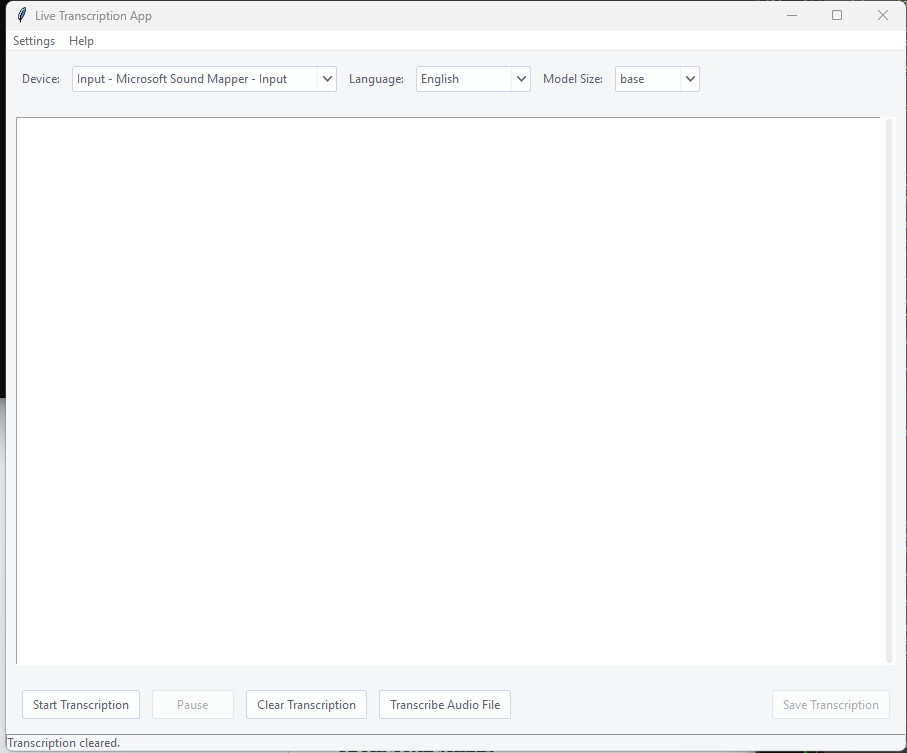

# Whisper GUI

  
*A powerful, real-time transcription app with Whisper AI, built with Python and Tkinter.*

## 🚀 Overview
Whisper GUI is a real-time speech-to-text application leveraging OpenAI's Whisper model to provide high-accuracy transcriptions. It supports multiple languages, various model sizes, and advanced features like voice activity detection (VAD) for improved accuracy.

## 🎯 Features
- **🎤 Live Transcription** and **Audio File Transcription** – Real-time and Audio File speech-to-text conversion using Whisper.
- **🛠️ Multi-Device Support** – Select and configure different input devices.
- **🌍 Multi-Language Support** – Transcribe in English, Spanish, French, German, and more.
- **📏 Adjustable Model Sizes** – Choose from `tiny`, `base`, `small`, `medium`, and `large`.
- **🖋️ Automatic Grammar Correction** – Uses LanguageTool to improve transcription quality.
- **🎚️ Theme & Font Customization** – Modern UI with theme and font settings.
- **💾 Save Transcriptions** – Export transcriptions to a `.txt` file.
- **⏸️ Pause & Resume** – Control transcription sessions easily.

## 📦 Installation
### Prerequisites
Ensure you have Python 3.8+ installed.

```sh
pip install -r requirements.txt
```

### Required Dependencies
- `torch`
- `whisper`
- `sounddevice`
- `webrtcvad`
- `tkinter`
- `ttkthemes`
- `numpy`
- `language_tool_python`

## 🏃 Usage
```sh
python whisper_gui.py
```

1. Select an **audio input device**.
2. Choose the **language** and **model size**.
3. Click **Start Transcription** or **Trancribe Audio File** to begin.
4. Pause or save the transcription as needed.

## 🛠️ Customization
- Change UI **themes** and **fonts** via the settings menu.
- Adjust **model size** for better performance vs accuracy.

## 🔥 Roadmap
- [ ] Add **speaker diarization** (identify different speakers)
- [ ] Enable **audio file transcription**
- [ ] Implement **real-time punctuation improvements**

## 🤝 Contributing
Pull requests are welcome! Feel free to **fork** this repository and submit improvements.

## 📜 License
MIT License

## 📢 Credits
Developed by **Brady Meighan**

---
🎙️ Built for speech-to-text enthusiasts and AI developers alike!

